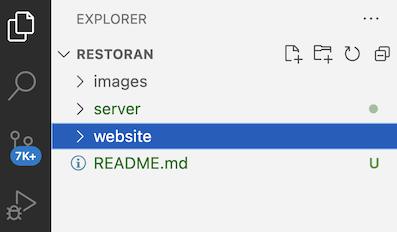
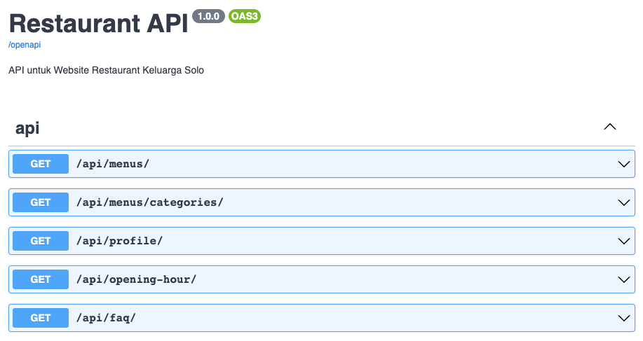

[](https://classroom.github.com/a/J1gXJrdq)
[](https://classroom.github.com/online_ide?assignment_repo_id=13191563&assignment_repo_type=AssignmentRepo)
# Tugas ke-2 TIF3221336 Pemrograman Web berbasis Framework: Membuat website restaurant Dengan ReactJS

### Deadline: Kamis 14 Desember 2023 Jam 23.59

## Pengantar
Tugas kali ini adalah **tugas kelompok**. Kalian diminta untuk membuat front-end website restaurant menggunakan ReactJS dengan data bersumber dari server backend. 

Repo tugas ini memiliki struktur sebagai berikut:




Folder `server` adalah backend server menggunakan Django yang akan menyediakan data restauran melalui web APIs.
Folder `website` adalah frontend server tempat anda menggerjakan tugas ini.

Anda bisa menggunakan `create-react-app`, NextJS React Framework ataupun React Framework lainnya. Anda juga diijinkan menggunakan React UI template ataupun HTML-CSS templates dari manapun, asalkan anda menyebutkan sumbernya. Semakin cantik dan indah template yang anda pilih/gunakan, akan semakin bagus.

## Daftar Web APIs
Dokumentasi endpoints (Web APIs) yang tersedia di backend server dapat diakses di halaman `http://127.0.0.1:8000/swagger-ui/`



Daftar endpoint tersebut adalah sbb:
1. Melihat Daftar Menu<br>
 `GET /api/menus/`<br>
 http://localhost:8000/api/menus/

2. Melihat Daftar Kategori Menu<br> 
`GET /api/menus/categories/`<br>
 http://localhost:8000/api/menus/categories/
3. Melihat Profil Restoran<br> 
`GET /api/profile/`<br>
 http://localhost:8000/api/profile/
4. Melihat Jam Buka Restoran<br> 
`GET /api/opening-hour/`<br>
 http://localhost:8000/api/opening-hour/
5. Melihat Daftar FAQs<br> 
`GET /api/faq/`<br>
 http://localhost:8000/api/faq/


## Mensetup dan Menjalankan Backend Server
### 1. Pastikan anda membuat virtual environtment `.venv` di dalam folder server
```bash
cd server
$ python -m venv .venv
```

### 2. Aktifkan virtual environtment
Untuk MacOs dan Linux (Bash atau Zsh Shell)
```bash
$ source .venv/bin/activate
```
Untuk Windows Command Shell
```bash
$. ./.venv/Scripts/activate
```

### 3. Upgrade pip
```bash
(.venv) $ pip install pip --upgrade
```

### 4. Install Django dan packages lainnya yang ada di file `requirements.txt`
```bash
(.venv) $ pip install -r requirements.txt
```
### 5. Jalankan server backend
```bash
(.venv) $ python manage.py runserver
```
## Penilaian
1. Meskipun tugas kelompok, semua anggota harus bekerja. Nilai setiap anggota bergantung juga pada keaktifan yang terlihat dari GitHub commits history.
2. Software yang anda submit harus bisa dijalankan
3. Kalian wajib membuat dokumentasi menggunakan file `DOKUMENTASI.md` yang ada di repo ini. Isi dokumentasi meliputi:
- Pembagian tugas. Siapa mengerjakan apa.
- Cara menjalankan website anda.
- Sumber/referensi yang anda gunakan. Misalkan jika menggunakan template, tuliskan URL template tersebut.
4. Demo dan presentasi. Perkuliahan pekan 12 hanya berisi presentasi tim dari kalian dan juga tanya jawab jika kalian menjumpai kesulitan dalam tugas ini.

## Bonus nilai
Anda bisa mendapatkan ekstra/bonus nilai jika 
1. Menambahkan endpoints (web apis) di backend dan menampilkan isinya di frontend. Misalkan menambahkan endpoint tentang galerry, testimoni pelanggan, dll.
2. Melakukan _deployment_ ke production server. Untuk Backend bisa menggunakan [Google AppEngine](https://cloud.google.com/appengine/docs) atau [Railway](https://railway.app/). Untuk Frontend bisa menggunakan platform dari [Netlify](https://www.netlify.com/) atau [Vercel](https://vercel.com/).
3. Menambahkan UnitTest baik itu di backend ataupun di frontend.

## Lain-lain
### 1. Halaman Admin di Server Backend
Jika anda ingin mengakses halaman admin, gunakan credential berikut ini: 
* user: admin
* password: !ADqswe3pNa!8ES8
Anda bebas menambahkan sampel data backend melalui halaman admin ini.

### 2. Pilih NIM dan Kelompok di GitHub Classroom
* Ketika anda menerima invitation dari GitHub Classroom, pastikan anda memilih NIM anda, bukan NIM mhs lainnya!
* Pilih kelompok yang sudah anda sepakati dengan teman-teman anda. Jika anda belum punya kelompok, silahkan bertanya ke teman anda.
### 3. Slack Discussion
Jika ada hal yang perlu ditanyakan, silahkan diposting di Discord di channel `tugas2-reactjs`. Jika ada yang ingin dibahas secara private, silahkan gunakan fitur DM di Discord. Jika anda belum bergabung Discord, silahkan bergabung di [sini](https://discord.gg/9V9xz8XW).